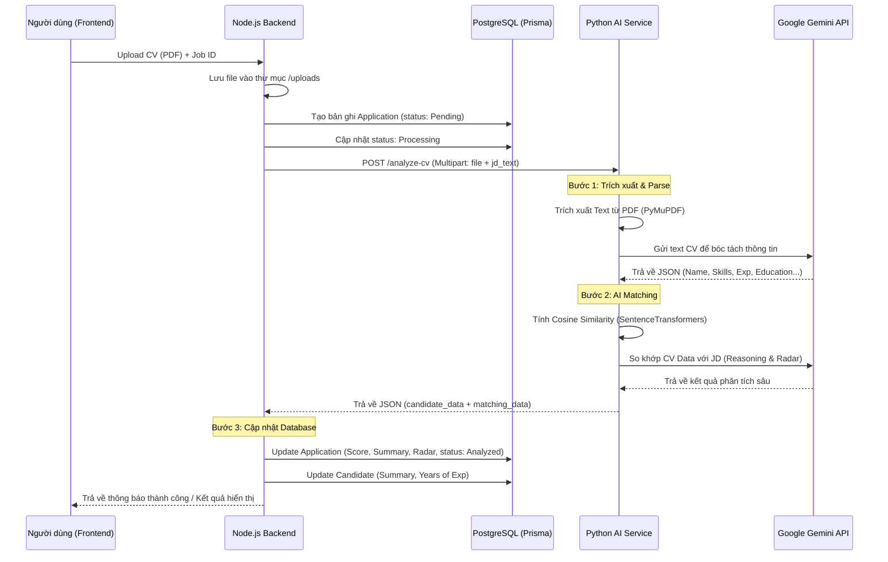

# Current System Architecture - Recruitment Assistant

Tài liệu này mô tả kiến trúc hiện tại của hệ thống Recruitment Assistant, tập trung vào luồng xử lý CV tự động bằng AI.

## 1. Sơ đồ luồng dữ liệu (Data Flow)

Dưới đây là quy trình chi tiết từ khi người dùng tải CV lên cho đến khi kết quả phân tích được lưu trữ.

### Chi tiết từng bước:
1.  **Tiếp nhận CV**: Người dùng upload file PDF qua Frontend. Node.js (Express) tiếp nhận, lưu file vào hệ thống và khởi tạo trạng thái trong Database qua Prisma.
2.  **Gửi sang AI Service**: Backend đọc file từ ổ đĩa, đính kèm nội dung Job Description (JD) từ Database và gửi một request HTTP POST (`multipart/form-data`) sang Python Service.
3.  **Trích xuất văn bản (Task 1)**: Python Service sử dụng thư viện `PyMuPDF` (fitz) để đọc nội dung text thô từ file PDF.
4.  **Bóc tách dữ liệu (Parsing)**: Text thô được gửi tới `Gemini 3 Flash` để chuyển đổi thành cấu trúc JSON chuẩn (bao gồm tên, email, kỹ năng, học vấn...).
5.  **So khớp thông minh (Matching - Task 2 & 3)**:
    *   Sử dụng `SentenceTransformers` (`all-MiniLM-L6-v2`) để tính toán độ tương đồng toán học giữa CV và JD.
    *   Gửi dữ liệu đã parse và JD tới `Gemini 3 Flash` một lần nữa để thực hiện đánh giá định tính: đưa ra điểm số cuối cùng, giải thích lý do (reasoning), liệt kê kỹ năng còn thiếu (skill gaps) và chấm điểm các khía cạnh (skills radar).
6.  **Phản hồi & Lưu trữ**: Kết quả trả về cho Node.js dưới dạng JSON. Backend thực hiện cập nhật các bảng `applications` và `candidates` trong PostgreSQL.

---

## 2. Tech Stack & Components

### Backend (Node.js Module)
- **Runtime**: Node.js (TypeScript)
- **Framework**: Express
- **ORM**: Prisma (kết nối PostgreSQL)
- **Communication**: `axios` & `form-data` (để gọi AI Service)

### AI Service (Python Module)
- **Framework**: FastAPI
- **Web Server**: Uvicorn
- **PDF Engine**: PyMuPDF (`fitz`)
- **LLM**: Google Gemini API (`gemini-3-flash-preview`)
- **NLP/Embedding**: `sentence-transformers` (`all-MiniLM-L6-v2`)
- **Environment**: Python 3.9+

### Infrastructure & Storage
- **Database**: PostgreSQL
- **File Storage**: Local File System (thư mục `uploads/` trong backend)
- **Deployment**: Docker & Docker Compose (quản lý backend, ai-service và database)

---

## 3. Cơ chế giao tiếp (Communication Mechanism)

Hệ thống sử dụng cơ chế **RESTful API** để giao tiếp giữa các service:

- **Phương thức**: `POST`
- **Endpoint**: `http://ai-service:8000/analyze-cv`
- **Kiểu dữ liệu gửi đi (Request)**: `multipart/form-data`
    - `file`: File nhị phân (PDF) trích xuất trực tiếp từ file system của backend.
    - `jd_text`: Chuỗi văn bản chứa mô tả công việc.
- **Kiểu dữ liệu nhận về (Response)**: `application/json`
    - Chứa hai object chính: `candidate_data` (thông tin cá nhân) và `matching_data` (kết quả phân tích AI).
- **Cơ chế xử lý**: Đồng bộ (Synchronous) từ góc độ AI Service, nhưng Backend xử lý bất đồng bộ (Async/Await) để không làm treo luồng chính khi chờ LLM phản hồi (timeout cấu hình 60 giây).
