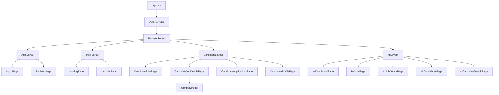

# Frontend & UX Architecture Analysis - Recruitment Assistant

Tài liệu này phân tích cấu trúc Frontend, cách quản lý trạng thái và luồng trải nghiệm người dùng hiện tại của dự án.

## 1. Sơ đồ Cây Component (Component Hierarchy)

Hệ thống được tổ chức theo kiến trúc **Layout-based Routing** sử dụng React Router.

### Chi tiết phân bổ:
- **Layouts**: Đóng vai trò là khung xương (Shell) chứa Sidebar, Header và quản lý quyền truy cập.
- **Pages**: Chứa logic nghiệp vụ chính của từng màn hình.
- **Modals/Common Components**: Các component tái sử dụng như `JobApplyModal` được gọi từ Page để giữ sự tập trung cho logic.

---

## 2. Quản lý Trạng thái (State Management)

Hệ thống sử dụng kết hợp giữa **Context API** cho trạng thái toàn cục và **Local State** cho trạng thái thành phần.

### Trạng thái Toàn cục (Global State)
- **Công nghệ**: React Context API (`AuthContext`).
- **Dữ liệu lưu trữ**:
    - `user`: Thông tin người dùng hiện tại (ID, tên, email, role).
    - `token`: JWT Access Token.
    - `isAuthenticated`: Flag kiểm tra trạng thái đăng nhập.
    - `isHR / isCandidate`: Flag kiểm tra vai trò.
- **Cơ chế**: Dữ liệu được persist vào `localStorage` để duy trì phiên làm việc khi refresh trang.

### Trạng thái Thành phần (Local State)
- **Công nghệ**: `useState`, `useEffect`.
- **Dữ liệu lưu trữ**:
    - Trạng thái UI: `loading` (hiện Spin), `error` (hiện Alert), `applyOpen` (đóng/mở modal).
    - Dữ liệu API: Kết quả fetch từ backend (danh sách Job, chi tiết ứng viên, điểm số AI).
- **Truyền dữ liệu**: Chủ yếu qua **Props** từ Page xuống các Component con.

---

## 3. Tích hợp API (API Integration)

Frontend giao tiếp với Backend qua lớp Service tập trung để tăng tính tái sử dụng và dễ bảo trì.

### Cơ chế kết nối:
- **Thư viện**: Axios.
- **Base Client**: `apiClient` (cấu hình `baseURL`, `interceptors` để đính kèm Token tự động).

### Các điểm tích hợp chính:
1.  **Auth Service**: Đăng nhập, đăng ký, lấy thông tin cá nhân.
2.  **Job Service**:
    - `getJobs()`: Lấy danh sách việc làm.
    - `getJobById(id)`: Lấy chi tiết công việc.
3.  **Application Service**:
    - `submitApplication()`: **Quan trọng nhất**, gửi Multipart Form (file PDF + metadata) từ `CandidateJobDetailsPage`.
4.  **Dashboard Service**:
    - Lấy thông tin ứng viên và kết quả AI Analysis (`HrCandidateDetailsPage`).
    - Cập nhật trạng thái hồ sơ (`patchStatus`).

### Xử lý trạng thái UX:
- **Loading**: Sử dụng component `Spin` (Ant Design) bao phủ vùng dữ liệu đang load hoặc toàn màn hình.
- **Error**: Sử dụng `Alert` hoặc `message.error` để thông báo lỗi từ server (thông qua utility `getApiErrorMessage`).
- **Success**: Sử dụng `message.success` cho các hành động như "Nộp đơn thành công" hoặc "Cập nhật trạng thái thành công".

---

## 4. Đặc điểm UX/UI (UX Observations)

- **Aesthetics**: Sử dụng phong cách **Glassmorphism** (trong lớp CSS `candidate-jobGlassCard`) tạo cảm giác hiện đại, cao cấp.
- **Feedback Loop**: Hệ thống cung cấp phản hồi trực quan qua các Tag màu sắc (ví dụ: điểm AI > 70% là màu xanh, trạng thái Rejected màu đỏ).
- **Visualization**: Sử dụng `Progress` và các khối phân tích chi tiết (Radar breakdown) để HR dễ dàng quét thông tin thay vì đọc văn bản thuần.
