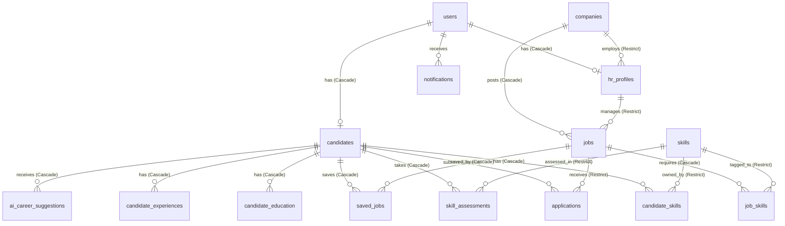

# 🗄️ Database Health Report
**ISM Recruitment Assistant — Full Diagnostic Audit**
*Generated: 2026-05-06 | Environment: Supabase (PostgreSQL) | Prisma v7.7.0*

---

## Part 1 — Schema & Relationship Analysis

### Entity Relationship Map



### Foreign Key Verification

| Relationship | FK Field | Constraint | Status |
|---|---|---|---|
| `candidates` → `users` | `user_id` | `@unique`, `onDelete: Cascade` | ✅ Correct |
| `hr_profiles` → `users` | `user_id` | `@unique`, `onDelete: Cascade` | ✅ Correct |
| `hr_profiles` → `companies` | `company_id` | `onDelete: Restrict` | ✅ Correct |
| `jobs` → `companies` | `company_id` | `onDelete: Cascade` | ✅ Correct |
| `jobs` → `hr_profiles` | `hr_id` | `onDelete: Restrict` | ✅ Correct |
| `applications` → `jobs` | `job_id` | `onDelete: Restrict` | ✅ Correct |
| `applications` → `candidates` | `candidate_id` | `onDelete: Restrict` | ✅ Correct |
| `job_skills` | `[job_id, skill_id]` | Composite PK | ✅ Correct |
| `candidate_skills` | `[candidate_id, skill_id]` | Composite PK | ✅ Correct |

> [!NOTE]
> All FK constraints are properly defined. The `onDelete: Restrict` on `applications` is intentional — deleting a job or candidate that has applications requires explicit data cleanup.

---

## Part 2 — Live Data Overview

### 2.1 Record Counts by Table

| Table | Count | Notes |
|---|---|---|
| **users** | **19** | |
| └─ HR role | 7 | |
| └─ Candidate (User) role | 12 | |
| **hr_profiles** | **7** | 1:1 with HR users ✅ |
| **companies** | **71** | |
| **jobs** | **262** | All status: `Open` |
| **candidates** | **12** | 1:1 with Candidate users ✅ |
| **applications** | **13** | |
| **skills** (master) | **29** | 22 Technical, 4 Soft Skill, 3 Language |
| saved_jobs | 0 | |
| notifications | 0 | |
| ai_career_suggestions | 0 | |
| skill_assessments | 0 | |
| candidate_education | 0 | ⚠️ |
| candidate_experiences | 0 | ⚠️ |

### 2.2 Skills Join Table Usage

| Join Table | Records | Assessment |
|---|---|---|
| `job_skills` (Jobs ↔ Skills) | **0** | 🔴 Critical Gap — No jobs have skills tagged |
| `candidate_skills` (Candidates ↔ Skills) | **48** | ✅ In use — avg 4 skills/candidate |

---

## Part 3 — Relationship Integrity (Orphan Check)

All referential integrity checks **PASSED**. No orphan data found.

| Check | Result |
|---|---|
| Candidates with no linked User | ✅ 0 orphans |
| Applications pointing to invalid Job | ✅ 0 orphans |
| Applications pointing to invalid Candidate | ✅ 0 orphans |
| HR Profiles with no valid Company | ✅ 0 orphans |
| Candidates with wrong `user_role` (not `User`) | ✅ 0 mismatches |
| HR Profiles with wrong `user_role` (not `HR`) | ✅ 0 mismatches |
| Floating Users (no candidate *or* HR profile) | ✅ 0 floating |

> [!IMPORTANT]
> The role-to-profile mapping is **100% consistent** across all 19 users. Every HR user has an `hr_profile`, every Candidate user has a `candidates` record, and no user exists without a profile.

---

## Part 4 — AI Pipeline Readiness

### 4.1 AI Scoring Coverage

| Metric | Count | Coverage |
|---|---|---|
| Applications WITH `ai_matching_score` | **12** | 92.3% |
| Applications WITHOUT `ai_matching_score` | **1** | 7.7% — 1 pending app |
| Applications with non-empty `ai_summary` | **12** | 92.3% |
| Applications with non-empty `skills_radar` | **12** | 92.3% |

> [!TIP]
> The AI pipeline has successfully processed 12/13 applications. The 1 unprocessed application has `processing_status = Pending`, indicating it was submitted but hasn't been picked up by the AI worker yet.

### 4.2 Processing Status Breakdown

| `processing_status` | Count |
|---|---|
| `Analyzed` | 12 ✅ |
| `Pending` | 1 🕐 |

### 4.3 HR Review Status Breakdown

| `hr_status` | Count |
|---|---|
| `Pending` | 5 |
| `Shortlisted` | 3 |
| `Interviewing` | 2 |
| `Rejected` | 3 |

---

## Part 5 — Gap Analysis

### 🔴 Critical Gaps

| # | Issue | Impact | Affected Records |
|---|---|---|---|
| 1 | **`job_skills` table is EMPTY** | AI matching cannot compare job requirements vs. candidate skills. The skills radar becomes a candidate-only metric with no job baseline. | 262 jobs |
| 2 | **No `candidate_education` records** | Candidate profiles are incomplete. Education history is missing for all 12 candidates. | 12 candidates |
| 3 | **No `candidate_experiences` records** | Work/internship history is missing for all 12 candidates. The `years_of_experience` field (default=0) is likely inaccurate. | 12 candidates |

### ⚠️ Minor Gaps

| # | Issue | Impact | Affected Records |
|---|---|---|---|
| 4 | **2 candidates have 0 skills** | These candidates will have empty `skills_radar` charts and lower AI matching scores. | 2 candidates |
| 5 | **No saved jobs** | The bookmarking feature is untested/unused in seed data. | — |
| 6 | **No notifications** | The notification system has no data; cannot verify delivery pipeline. | — |
| 7 | **No AI career suggestions** | The `ai_career_suggestions` table is empty; the career guidance feature is untested. | — |
| 8 | **71 companies but only 7 have HR users** | 64 companies appear to be from an external/legacy data import with no associated HR managers. | 64 companies |

---

## Part 6 — Summary & Recommendations

### Overall Health Score: 🟡 Moderate (Functional Core, Missing Enrichment Data)

```
✅ FK & Referential Integrity:  PERFECT (0 orphan records)
✅ AI Pipeline:                 ACTIVE (12/13 apps analyzed)
✅ User-Profile Mapping:        CORRECT (19/19 users mapped)
🔴 Job Skills Tagging:          MISSING (0/262 jobs have skills)
🔴 Candidate Education/Exp:     MISSING (0/12 candidates have history)
⚠️  Feature Tables:              EMPTY (saved_jobs, notifications, suggestions)
```

### Recommended Actions (Priority Order)

1. **[P0] Tag jobs with skills** — Run `prisma/seed-demo.ts` or a migration script to populate `job_skills`. This is a prerequisite for meaningful AI skill-gap analysis.
2. **[P0] Seed candidate education & experience** — Update seed data to add education and work history records so candidate profiles are complete.
3. **[P1] Trigger the 1 pending application** — Manually requeue or re-trigger the AI worker for the single `Pending` application.
4. **[P2] Audit the 64 orphan companies** — Determine if they were created from a bulk import. If not needed for demo, consider pruning to reduce noise in HR dropdown selectors.
5. **[P2] Seed notification & career suggestion data** — Add test records to validate these pipelines before the demo.
